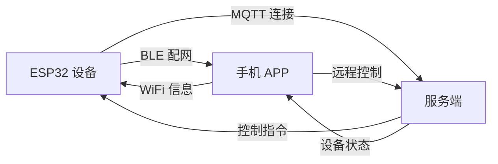
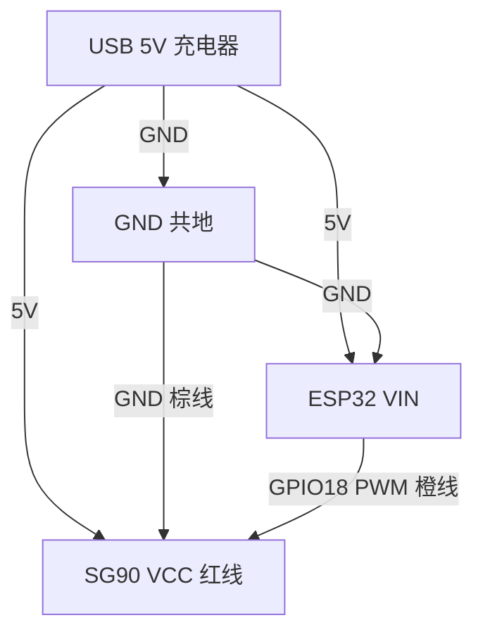
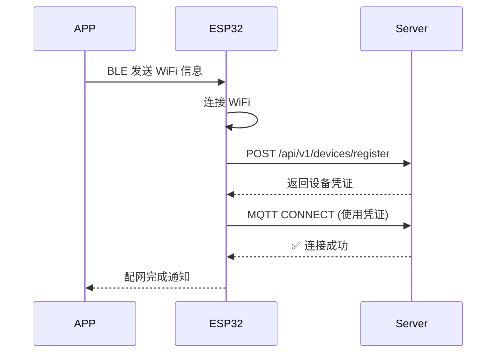
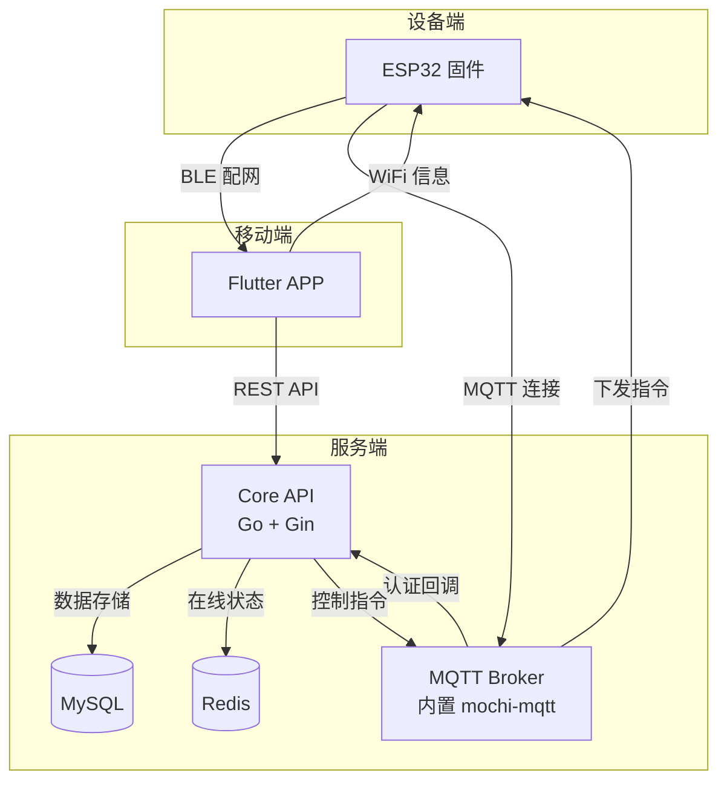

# 使用教程：从零搭建你的 IoT 系统

> 30 分钟，从一块 ESP32 开发板到一个可远程控制的智能设备系统。无需 IoT 经验，跟着做就行。

## 你将得到什么

完成本教程后，你将拥有一套完整的 IoT 系统：



| 组件 | 说明 | 成本 |
|------|------|------|
| ESP32 开发板 | 设备端 | ¥15-30 |
| SG90 舵机 | 执行器（可选） | ¥3-5 |
| 手机 APP | 配网+控制 | 免费 |
| 云服务器 | 服务端 | 阿里云/腾讯云轻量 ¥50/月起 |

---

## 第一步：部署服务端

### 1.1 准备一台服务器

你需要一台能访问公网的服务器（阿里云、腾讯云、华为云均可）。

**最低配置**：
- 1 核 2G 内存
- Ubuntu 20.04+ / CentOS 7+
- 开放端口：48080、48883

### 1.2 安装 Docker

```bash
# 快速安装 Docker（官方脚本）
curl -fsSL https://get.docker.com | sh
systemctl enable docker && systemctl start docker

# 安装 Docker Compose
apt install docker-compose-plugin
# 或
yum install docker-compose-plugin
```

验证安装：

```bash
docker --version
docker compose version
```

### 1.3 一键启动 IoT 平台

```bash
# 克隆仓库
git clone https://gitee.com/luoyaosheng/lys-iot-platform.git
cd lys-iot-platform/server

# 启动所有服务
docker compose up -d
```

<!-- 📸 截图占位：终端显示 docker compose up -d 的输出，四个容器依次启动 -->

启动完成后，验证服务状态：

```bash
# 检查容器状态（应该看到 4 个容器都是 Up）
docker compose ps

# 测试 API
curl http://localhost:48080/api/v1/products
```

如果返回 JSON 数据，说明服务端部署成功 ✅

> 💡 **本地体验**：如果只是想试试，可以用自己的电脑代替服务器。安装 Docker Desktop 后直接执行上面的命令即可。

---

## 第二步：烧写固件

### 2.1 购买硬件

**智能开关方案**（推荐入门）：

<!-- 📸 照片占位：ESP32 开发板 + SG90 舵机 + 杜邦线 全家福 -->

| 硬件 | 购买关键词 | 参考价 |
|------|----------|--------|
| ESP32 开发板 | "ESP32-WROOM-32E 开发板 38引脚" | ¥15 |
| SG90 舵机 | "SG90 舵机 9g" | ¥3 |
| 杜邦线 | "杜邦线 公对母" | ¥2 |
| USB 数据线 | "Micro USB 数据线" | ¥5 |

**USB 唤醒方案**（进阶）：

| 硬件 | 购买关键词 | 参考价 |
|------|----------|--------|
| ESP32-S3 开发板 | "ESP32-S3-DevKitC-1 N16R8" | ¥30 |
| USB 数据线 | "USB-C 数据线" | ¥5 |

### 2.2 安装烧写工具

**方案 A：PlatformIO（开发者推荐）**

1. 安装 [VS Code](https://code.visualstudio.com/)
2. 安装 PlatformIO IDE 插件
3. 打开终端，进入固件目录

```bash
cd lys-iot-platform/firmware/switch
pio run -t upload
```

**方案 B：ESP Flash Download Tool（无需编程环境）**

1. 下载 [Flash Download Tool](https://www.espressif.com/zh-hans/support/download/other-tools)
2. 从 [Release 页面](https://github.com/LuoYaoSheng/lys-iot-platform/releases) 下载固件包

<!-- 📸 截图占位：Flash Download Tool 界面，标注烧写地址 -->

烧写地址配置：

| 固件文件 | 地址 |
|---------|------|
| bootloader-esp32.bin | 0x1000 |
| partitions-esp32.bin | 0x8000 |
| esp32-servo-firmware.bin | 0x10000 |

### 2.3 连接舵机（智能开关方案）



接线总结：

| SG90 舵机线 | 连接到 |
|------------|--------|
| 红线 (VCC) | 5V 电源正极 |
| 棕线 (GND) | 电源负极 / ESP32 GND |
| 橙线 (Signal) | ESP32 GPIO18 |

<!-- 📸 照片占位：实际接线照片，标注红线/棕线/橙线连接位置 -->

> ⚠️ **注意**：舵机峰值电流约 500mA，务必与 ESP32 共地，从 5V 电源直接供电。

---

## 第三步：安装手机 APP

### 3.1 下载安装

从 [Release 页面](https://github.com/LuoYaoSheng/lys-iot-platform/releases) 下载 `iot-config-app.apk`，安装到 Android 手机。

<!-- 📸 截图占位：APP 图标在手机桌面 -->

### 3.2 配置服务器地址

1. 打开 APP
2. 点击登录页面**右上角的服务器图标** ⚙️
3. 填写你的服务器地址：

<!-- 📸 截图占位：服务器地址配置界面 -->

| 配置项 | 填写内容 |
|--------|---------|
| API 服务器地址 | `http://你的服务器IP:48080` |
| MQTT 服务器地址 | `你的服务器IP` |

4. 保存 → 重启 APP

### 3.3 注册账号

重启 APP 后，注册一个新账号并登录。

<!-- 📸 截图占位：注册/登录界面 -->

---

## 第四步：BLE 配网（连接设备）

这是最关键的一步——让设备连上 WiFi 并注册到你的 IoT 平台。

### 4.1 设备进入配网模式

ESP32 上电后，LED 会**五次快闪**，表示已进入 BLE 配网模式。

```
设备蓝牙广播名称格式：
  IoT-Switch-XXXX   → 智能开关设备
  IoT-Wakeup-XXXX   → USB 唤醒设备

  XXXX = 设备 MAC 后四位
```

### 4.2 APP 扫描设备

1. 打开 APP → 点击 **"添加设备"** 或 **"+"** 按钮
2. APP 开始扫描附近的蓝牙设备
3. 在列表中找到你的设备（如 `IoT-Switch-A1B2`）

<!-- 📸 截图占位：APP 蓝牙扫描列表，高亮目标设备 -->

### 4.3 输入 WiFi 信息

1. 选择目标设备
2. 输入你家的 WiFi 名称和密码
3. 点击"开始配网"

<!-- 📸 截图占位：WiFi 配置界面 -->

> ⚠️ **重要**：仅支持 2.4GHz WiFi，不支持 5GHz。

### 4.4 等待配网完成

配网过程约 10-30 秒，设备会自动完成：



LED 状态变化：
- **五次快闪** → BLE 配网模式
- **三次快闪** → WiFi 连接中
- **二次快闪** → 平台注册 / MQTT 连接中
- **慢闪（1 秒间隔）** → ✅ 正常运行

<!-- 📸 截图占位：配网成功界面 -->

---

## 第五步：远程控制设备

配网成功后，设备会出现在 APP 的设备列表中。

### 5.1 查看设备列表

<!-- 📸 截图占位：设备列表界面，显示在线/离线状态 -->

### 5.2 控制设备

点击设备 → 进入控制面板：

**智能开关**：
- Toggle 模式：开关切换，舵机执行物理按压
- 可设定按压角度和时间

**USB 唤醒**：
- 一键唤醒：触发 USB HID 键盘事件
- 远程唤醒休眠的电脑

<!-- 📸 截图占位：设备控制界面 -->

### 5.3 验证控制效果

点击控制按钮后：
- 智能开关：舵机会物理按压墙壁开关
- USB 唤醒：休眠的电脑会被唤醒

整个控制链路的延迟通常在 **200ms 以内**。

---

## 系统架构总览

至此，你的 IoT 系统已经完整运行。以下是整个系统的数据流：



---

## 接下来可以做什么

### 添加更多设备

重复第四步的配网流程，可以添加多台设备。每台设备独立注册，APP 自动管理。

### 自定义固件

基于现有固件二次开发：
- [固件开发指南](/FIRMWARE_GUIDE) — 修改 GPIO、添加传感器
- [设备统一规范](/DEVICE_UNIFIED_SPEC) — 接入新设备类型

### 扩展服务端

- [服务端开发指南](/SERVER_GUIDE) — 本地开发、添加 API
- [API 参考](/API_REFERENCE) — 完整 REST API 文档

### 生产部署

- [部署与运维](/DEPLOYMENT_GUIDE) — SSL 证书、安全加固
- [故障排查](/TROUBLESHOOTING) — 遇到问题先看这里

---

## 常见问题

### Docker 启动失败？

```bash
# 查看具体错误
docker compose logs

# 常见原因：端口被占用
lsof -i :48080
```

### 设备扫描不到蓝牙？

- 确认设备已上电且 LED 在五次快闪
- Android 需开启**定位服务** + **蓝牙权限**
- 距离设备 1-3 米内

### 配网后设备不上线？

1. 确认 WiFi 是 2.4GHz
2. 确认服务器 IP 和端口正确
3. 检查防火墙是否开放 48080、48883 端口
4. 查看设备串口日志：`pio device monitor`

### APP 无法连接服务端？

浏览器访问 `http://你的服务器IP:48080/health`，如果打不开说明网络不通。

> 更多问题请参考 [故障排查指南](/TROUBLESHOOTING)

---

## 需要帮助？

- [GitHub Issues](https://github.com/LuoYaoSheng/open-iot-platform/issues) — 报告 Bug 或提建议
- [Gitee Issues](https://gitee.com/luoyaosheng/lys-iot-platform/issues) — 国内访问
- [贡献指南](/CONTRIBUTING) — 参与项目开发
