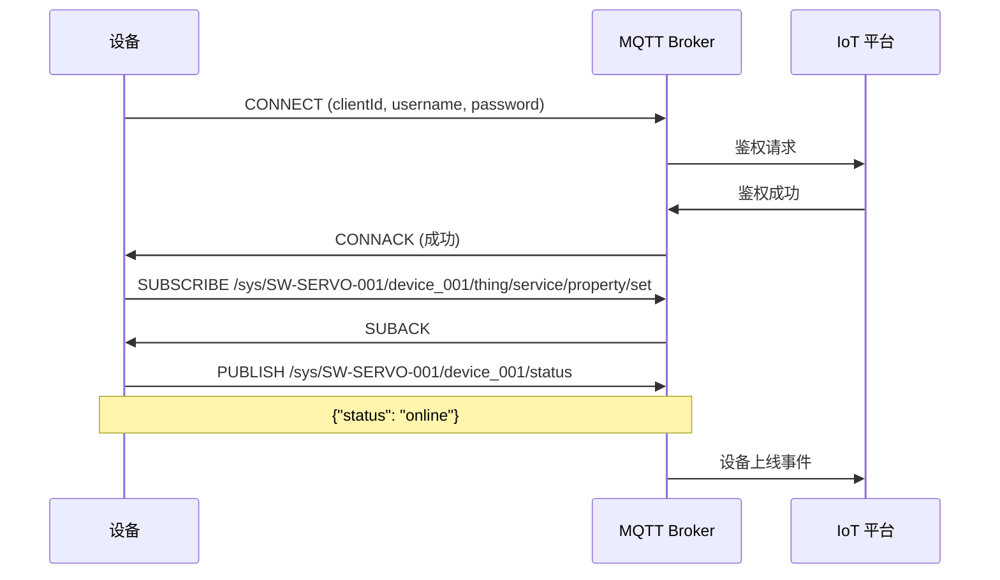
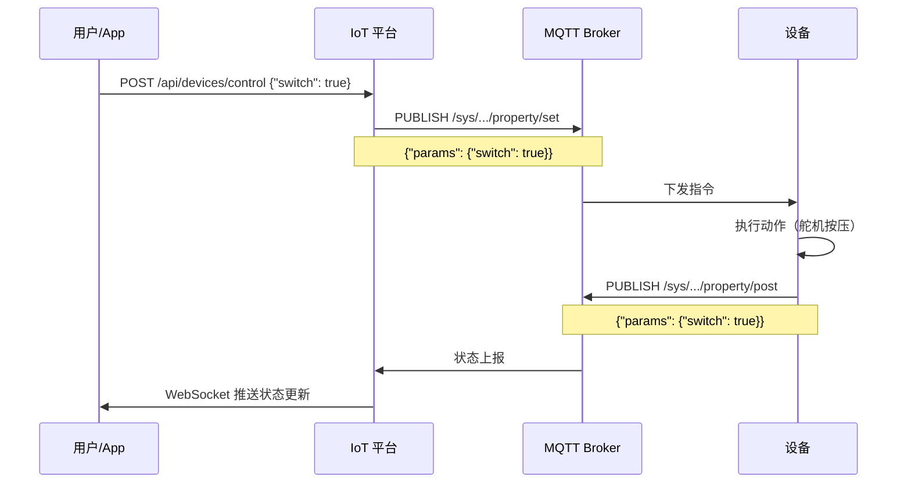
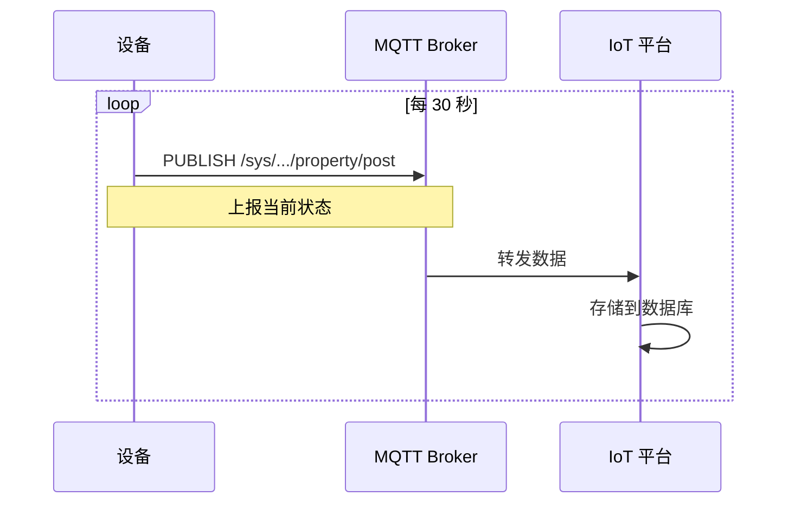

# MQTT 通信协议规范

**产品**: 智能开关 (舵机版)
**ProductKey**: `SW-SERVO-001`
**协议版本**: v1.0
**作者**: 罗耀生
**日期**: 2025-12-13

---

## 📡 协议概述

智能开关通过 MQTT 协议与 IoT 平台进行通信，实现远程控制和状态上报。

**通信模式**:
- **下行**: 平台 → 设备（控制指令）
- **上行**: 设备 → 平台（状态上报）

**QoS 级别**:
- 控制指令: QoS 1 (至少一次)
- 状态上报: QoS 0 (至多一次)

---

## 🔐 设备认证

### 方式一：用户名密码认证

```
ClientID: {productKey}&{deviceId}
Username: {deviceId}
Password: {deviceSecret}

示例:
ClientID: SW-SERVO-001&device_001
Username: device_001
Password: abc123def456
```

### 方式二：Token 认证（推荐）

```
1. 设备向平台 API 请求 Token
   POST /api/v1/devices/token
   {
     "productKey": "SW-SERVO-001",
     "deviceId": "device_001",
     "deviceSecret": "abc123def456"
   }

2. 平台返回 Token（有效期 24 小时）
   {
     "token": "eyJhbGciOiJIUzI1NiIsInR5cCI6IkpXVCJ9...",
     "expiresIn": 86400
   }

3. MQTT 连接时使用 Token
   ClientID: {productKey}&{deviceId}
   Username: {deviceId}
   Password: {token}
```

---

## 📋 Topic 设计

### Topic 命名规范

```
/sys/{productKey}/{deviceId}/{function}

组成部分:
- /sys: 系统主题前缀
- {productKey}: 产品标识 (SW-SERVO-001)
- {deviceId}: 设备唯一标识
- {function}: 功能路径
```

### 下行 Topic（设备订阅）

#### 1. 属性设置

```
Topic:
/sys/{productKey}/{deviceId}/thing/service/property/set

设备订阅此 Topic 接收平台下发的控制指令
```

#### 2. 服务调用（可选）

```
Topic:
/sys/{productKey}/{deviceId}/thing/service/{identifier}

用于调用设备的特定服务，如重启、恢复出厂设置等
```

### 上行 Topic（设备发布）

#### 1. 属性上报

```
Topic:
/sys/{productKey}/{deviceId}/thing/event/property/post

设备主动上报当前状态
```

#### 2. 事件上报

```
Topic:
/sys/{productKey}/{deviceId}/thing/event/{identifier}/post

上报特定事件，如故障、告警等
```

#### 3. 在线状态

```
Topic:
/sys/{productKey}/{deviceId}/status

设备上下线状态
```

---

## 📦 Payload 格式

所有 Payload 均使用 **JSON 格式**，UTF-8 编码。

### 下行：属性设置

```json
{
  "method": "thing.service.property.set",
  "id": "123456",
  "version": "1.0",
  "params": {
    "switch": true,
    "angle": 90
  },
  "timestamp": 1702456789000
}
```

**字段说明**:
| 字段 | 类型 | 必填 | 说明 |
|------|------|------|------|
| method | String | 是 | 方法名 |
| id | String | 是 | 消息 ID，用于响应关联 |
| version | String | 是 | 协议版本 |
| params | Object | 是 | 参数对象 |
| timestamp | Long | 是 | 时间戳（毫秒） |

**params 参数**:
| 参数 | 类型 | 说明 | 示例 |
|------|------|------|------|
| switch | Boolean | 开关状态 | true=开, false=关 |
| angle | Integer | 舵机角度 | 0-180 |

### 设备响应

```json
{
  "method": "thing.service.property.set_reply",
  "id": "123456",
  "code": 200,
  "data": {}
}
```

**code 状态码**:
| Code | 说明 |
|------|------|
| 200 | 成功 |
| 400 | 参数错误 |
| 500 | 设备内部错误 |

### 上行：属性上报

```json
{
  "method": "thing.event.property.post",
  "id": "789012",
  "version": "1.0",
  "params": {
    "switch": true,
    "angle": 90,
    "wifi_rssi": -45,
    "uptime": 3600
  },
  "timestamp": 1702456789000
}
```

**params 参数**:
| 参数 | 类型 | 说明 | 单位 |
|------|------|------|------|
| switch | Boolean | 当前开关状态 | - |
| angle | Integer | 当前舵机角度 | 度 |
| wifi_rssi | Integer | Wi-Fi 信号强度 | dBm |
| uptime | Integer | 运行时长 | 秒 |

### 平台响应（可选）

```json
{
  "method": "thing.event.property.post_reply",
  "id": "789012",
  "code": 200,
  "data": {}
}
```

---

## 🔄 通信流程

### 流程一：设备上线



### 流程二：远程控制



### 流程三：定时上报



---

## 🎯 设备行为规范

### 连接管理

1. **连接参数**
   ```
   Keep-Alive: 60 秒
   Clean Session: true
   QoS: 1 (控制指令)
   QoS: 0 (状态上报)
   ```

2. **断线重连**
   ```
   首次重连: 立即
   后续重连: 指数退避
     - 1次: 1秒
     - 2次: 2秒
     - 3次: 4秒
     - ...
     - 最大: 60秒
   ```

3. **心跳保持**
   ```
   每 60 秒发送 PINGREQ
   若 3 次无响应，主动断开重连
   ```

### 消息处理

1. **指令响应时间**
   ```
   收到指令后 3 秒内必须响应
   若超时，平台认为设备离线
   ```

2. **消息去重**
   ```
   根据 id 字段判断是否为重复消息
   保留最近 100 条消息 ID
   ```

3. **错误处理**
   ```
   若执行失败，返回错误码和原因:
   {
     "code": 500,
     "message": "Servo timeout"
   }
   ```

### 状态上报

1. **主动上报**
   ```
   - 设备状态变化时立即上报
   - 定时上报（每 30 秒）
   - 收到查询指令时上报
   ```

2. **上报内容**
   ```
   必填:
   - switch: 开关状态
   - angle: 舵机角度
   - wifi_rssi: Wi-Fi 信号

   可选:
   - uptime: 运行时长
   - free_heap: 剩余内存
   - error_count: 错误次数
   ```

---

## 🔧 调试与测试

### 使用 MQTT.fx 测试

1. **连接配置**
   ```
   Broker Address: mqtt.yourplatform.com
   Broker Port: 1883
   Client ID: SW-SERVO-001&device_test
   Username: device_test
   Password: your_device_secret
   ```

2. **订阅 Topic**
   ```
   /sys/SW-SERVO-001/device_test/#
   ```

3. **发布测试消息**
   ```
   Topic: /sys/SW-SERVO-001/device_test/thing/service/property/set

   Payload:
   {
     "method": "thing.service.property.set",
     "id": "test_001",
     "version": "1.0",
     "params": {
       "switch": true
     },
     "timestamp": 1702456789000
   }
   ```

### 使用 mosquitto 命令行

**订阅**:
```bash
mosquitto_sub -h mqtt.yourplatform.com -p 1883 \
  -u device_test -P your_device_secret \
  -t "/sys/SW-SERVO-001/device_test/#" \
  -v
```

**发布**:
```bash
mosquitto_pub -h mqtt.yourplatform.com -p 1883 \
  -u device_test -P your_device_secret \
  -t "/sys/SW-SERVO-001/device_test/thing/service/property/set" \
  -m '{"method":"thing.service.property.set","id":"test_001","params":{"switch":true}}'
```

---

## 📊 数据模型

### 物模型定义

```json
{
  "productKey": "SW-SERVO-001",
  "productName": "智能开关(舵机版)",
  "dataTemplate": {
    "properties": [
      {
        "identifier": "switch",
        "name": "开关状态",
        "dataType": "bool",
        "accessMode": "rw",
        "description": "true=开启, false=关闭"
      },
      {
        "identifier": "angle",
        "name": "舵机角度",
        "dataType": "int",
        "accessMode": "rw",
        "range": {
          "min": 0,
          "max": 180,
          "step": 1
        },
        "unit": "°",
        "description": "舵机当前角度"
      },
      {
        "identifier": "wifi_rssi",
        "name": "Wi-Fi 信号强度",
        "dataType": "int",
        "accessMode": "r",
        "range": {
          "min": -100,
          "max": 0
        },
        "unit": "dBm",
        "description": "Wi-Fi RSSI 值"
      },
      {
        "identifier": "uptime",
        "name": "运行时长",
        "dataType": "int",
        "accessMode": "r",
        "unit": "秒",
        "description": "设备启动后运行时间"
      }
    ],
    "events": [
      {
        "identifier": "status_change",
        "name": "状态变化",
        "type": "info",
        "outputData": [
          {
            "identifier": "switch",
            "dataType": "bool"
          }
        ]
      },
      {
        "identifier": "error",
        "name": "错误事件",
        "type": "error",
        "outputData": [
          {
            "identifier": "error_code",
            "dataType": "int"
          },
          {
            "identifier": "error_message",
            "dataType": "string"
          }
        ]
      }
    ],
    "services": [
      {
        "identifier": "toggle",
        "name": "切换开关",
        "inputParams": [],
        "outputParams": [
          {
            "identifier": "result",
            "dataType": "bool"
          }
        ]
      },
      {
        "identifier": "reset",
        "name": "重启设备",
        "inputParams": [],
        "outputParams": []
      }
    ]
  }
}
```

---

## 🔒 安全建议

### 1. 传输加密

```
使用 MQTT over TLS (端口 8883)

证书验证:
- 平台证书: 验证服务器身份
- 设备证书: 双向认证（可选）
```

### 2. 设备密钥管理

```
DeviceSecret 生成规则:
- 长度: 32 字符
- 字符集: [a-zA-Z0-9]
- 随机生成，每设备唯一

存储方式:
- 烧录时写入 Flash
- 不在代码中硬编码
```

### 3. 指令校验

```cpp
// 校验消息完整性
if (!doc.containsKey("method") ||
    !doc.containsKey("id") ||
    !doc.containsKey("params")) {
    return false;  // 丢弃无效消息
}

// 校验参数范围
int angle = doc["params"]["angle"];
if (angle < 0 || angle > 180) {
    return false;  // 参数超出范围
}
```

---

## 📄 相关文档

- [IoT 平台设计白皮书](../../iot-platform-docs/whitepaper/v1/iot-platform-whitepaper-v1.md)
- [硬件设计文档](./hardware-design.md)
- [固件开发指南](../../iot-platform-docs/guides/firmware-dev-guide.md)

---

**协议规范定义完成！** 🎉
